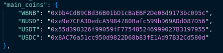
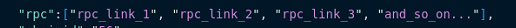

# 🚧 Add Dex, Coins or RPC

The dex.json file comes with a series of ready-to-use dexes

The file starts with a brace ' eg. { 'before the first number and numbers are enclosed in quotation marks ' eg "0" ' The file must always end with a brace ' eg } ' placed at the end of the file (as distributed). If you have any problems, please re-download the file.

You can see the number 0 on the PancakeSwap dex

The number 0 will always be the dex that will be loaded when the bot starts, so you can set your favorite dex as number 0.


There cannot be two zero numbers, so you will have to swap the numbers in case you want to change the position of the dex!


## :pancakes: DEX

* "name" - is the displayed name of the dex on the bot interface
* "factory\_address" - is the factory address of the dex
* "router\_address" - is the router address of the dex
* (If V3 fork) "quoter\_address" - is the quoter address of the dex
* "chain" - keep the following names for existing chains&#x20;

|  Name of the chain  | "chain" |
| :-----------------: | :-----: |
| Binance smart chain |   "56"  |
|       Ethereum      |   "1"   |
|       Arbitrum      | "42161" |
|       Polygon       |  "137"  |
|        Fantom       |  "250"  |
|        Cronos       |   "25"  |

## :coin: COIN

* "main\__coins_" - this is a list of coins that will be added on the coin selector. follow this schema:

<figure><figcaption>
Use the name of the coin and its address
</figcaption></figure>


The symbol is important for the proper functioning of the bots. to be sure that the symbol is correct, look for the main con in the respective explorer (for example, look for bnb on bscexplorer) You will notice that the symbol for BNB is actually WBNB So you will have to enter WBNB in "main\_coin\_symbol"



For the bot to work correctly it is necessary to fill in all the fields of the relative dex. Even if you don't want to add a coin, copy the peg coin address and symbol from one of the fields above so you don't leave it blank.


## :link: RPC

* "rpc" - is a list of rpcs links. You can add any number of rpcs, just following this schema:

<figure><figcaption>
RPC examples
</figcaption></figure>


For the bot to function correctly, the RPC fields must be filled in. If you don't have other RPCs available, just enter the same in all fields



The bot works better and is more effective with our RPCs on our VPS. You can subscribe monthly on our website: [https://latencyservice.aviddot.com](https://latencyservice.aviddot.com)&#x20;

Our nodes have:

* endless calls
* low latency (guaranteed only on our VPSs)&#x20;

In short, everything you need for the fastest snipes ever!


## Other Details

* "chainid" - The Chain id of the dex (you can check it [HERE](https://chainlist.org/))
* "api\_enpoint" - the link of the API chain explorer
* "api\_key" - the key for the API of the API chain explorer


API  ENDPOINT and API KEY they are needed to snipe the mempool

