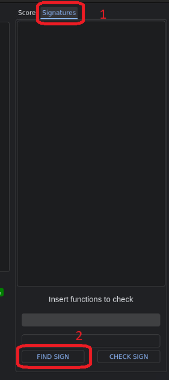
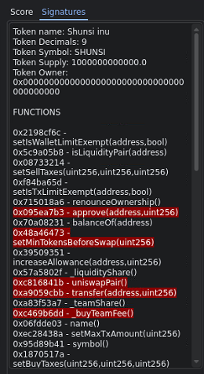
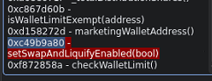
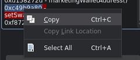
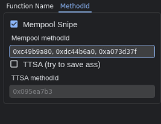

# 🔍 Find mempool MethoId from the bot


The transactions for adding or removing liquidity (add Liquidity etc ...) are sent to the Router address.&#x20;

While enable trading transactions (TradingEnabled, EnableTrading etc ...) are sent to the token address.


The bot can scan either on the router address or on the token address.

Depending on the transaction you are looking for, you will need to select Trading enabled or addingliquidity. After that you will have to enter the methoids in the corresponding field.

## How to find MethoId from the bot

Paste the contract of the Token that you want to scan

<figure><figcaption>
Paste token address in the field
</figcaption></figure>

Click on SIGNATURES label on the right, and than on FIND SIGN

<figure><figcaption>
Click on SIGNATURES than on FIND SIGN
</figcaption></figure>

A List of functions will be printed

<figure><figcaption>
List of all the functions available in the contract of the token
</figcaption></figure>

Find the MethoId that you need and copy it

<figure><figcaption>
Find it!
</figcaption></figure>

 

<figure><figcaption>
And copy it!
</figcaption></figure>

Now enable the Mempool Snipe selecting the METHOID LABEL

<figure><figcaption>
Enable mempool snipe selecting the METHOID
</figcaption></figure>

 

<figure><figcaption>
Add as many Methoid you want to check
</figcaption></figure>

Now start the bot and wait that it find the methoid in the mempool!

This works for TTSA as well
