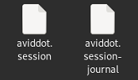

# 🛠 How to setup Telegram Scraper


Before being able to use the Telegram scraper, you need to follow the following steps to create the necessary files.


Follow this tutorial on YouTube to obtain the required data:


Obtain API hash and API id


Now you can fill in the tg\_config.json configuration file as shown in the following image.

\

<figure><figcaption>
tg_config.json example
</figcaption></figure>


The phone number should have the international prefix.



Note that the channels must be setted to 0 when you run the session creator


You can run now the file named session\_creator in the bot folder

&#x20;A Terminal window will show up and you will receive a message on telegram with a 6 digit code

Enter the code in the terminal and press enter


If you have protected your telegram account with a password, you will need to enter it in the terminal


Check in the bot folder that the .session file is created.

<figure><figcaption>
session files example
</figcaption></figure>

This file must remain in the same folder as the bot when it is running

You can now use the telegram scraper in the bot

## MAC users

For MAC users the usual rule applies. all files (including the session\_creator file) must be placed in the HOME FOLDER. The rest of the procedure is identical
