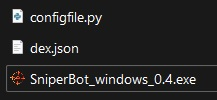

# 🖥 How to setup the bot

Download the bot and configuration files (configfile.py and dex.json)

FOR WINDOWS ONLY

Make sure that the name of the configfile file is configfile.py

If you can't see the file extensions like this:

<figure><figcaption>
FILES MUST NOT APPEAR LIKE THIS
</figcaption></figure>

&#x20;follow these link:&#x20;



After this, files will be like this:

<figure><figcaption>
FILES MUST APPEAR LIKE THIS
</figcaption></figure>

Open the configfile with a text editor (I suggest visual studio code) and go to the bottom of the file

Fill in the PUBLIC fields with the address of your wallet (the one that has the activation token) and PRIVATE with the private key of the same wallet

Save the file and close it.

Dex file is provided with 20 different dexes so is ready to use.

To check how to add a DEX click HERE

To check how to add a TOKEN click HERE
