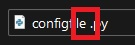
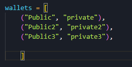
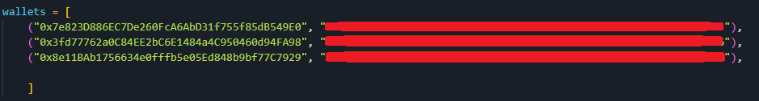
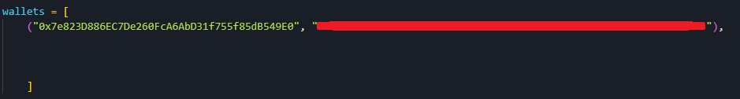

# 🖥 How to setup the bot

Download the bot and configuration files (configfile.py and dex.json)

FOR WINDOWS ONLY

Make sure that the name of the configfile file is configfile.py

If you can't see the file extensions like this:

<figure><figcaption>
FILES MUST NOT APPEAR LIKE THIS
</figcaption></figure>

&#x20;follow these link:&#x20;



After this, files will be like this:

<figure><figcaption>
FILES MUST APPEAR LIKE THIS
</figcaption></figure>

Make sure filenames don't have spaces or other characters like that.

<figure><figcaption></figcaption></figure>

Open the configfile with a text editor (I suggest visual studio code or a normal text editor is okay too) and go to the bottom of the file

<figure><figcaption>
Bottom of the copnfigfile
</figcaption></figure>

This is an array of wallets.

The first one must be the one that hold our token AVID2.0 ("Public", "private")

Replace PUBLIC with your public key and PRIVATE with your private key.

<figure><figcaption>
3 wallets
</figcaption></figure>

If you want to add one wallet only, just delete others lines

Remember that the first wallet must be the holder of the AVID2.0 Token

<figure><figcaption>
one wallet only
</figcaption></figure>

Save the file and close it.

Dex file is provided with 20 different dexes so is ready to use.

To check how to add a DEX click HERE

To check how to add a TOKEN click HERE
