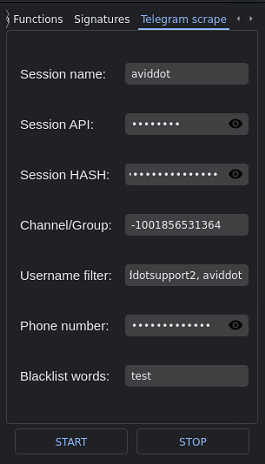

# 🌶 How to use Telegram scraper


Before being able to use the Telegram scraper, you must [setup ](how-to-setup-the-bot.md)it


<figure><figcaption>
Screen of telegram scraper
</figcaption></figure>

## Channel/Group field

In the Channel/Group field you have to set the id of the channel/group you want to monitor

Use this bot to pick the ID that you need [https://t.me/username\_to\_id\_bot](https://t.me/username\_to\_id\_bot)

Jjust send the group link to this bot to get the ID

Usually the ID starts with a sign (-)&#x20;

Example: -123456789&#x20;

You must also enter the sign in the field if there is (see the example screen above)

## Username filter field

In this field, you must enter the username of the user(s) you want to monitor.&#x20;

You must take into account the username with the @&#x20;

Example:&#x20;

If you want to monitor @Aviddotsupport2, you need to write only Aviddotsupport2 without the @&#x20;

You can enter as many users as you want, just separate them with a comma:&#x20;

Example: Aviddotsupport2, Aviddot, etc...

## Blacklist words

Here you can enter the word (or words, always separated by a comma), which do not execute the purchase.

Example:&#x20;

I insert the word TEST.&#x20;

If the phrase being sent to the group by the filtered user contains that word, and an address token, the bot will do nothing.&#x20;

It will just print a message explaining that it has detected a BlackWord.

You can enter as many words as you want, just separate them with a comma:&#x20;

Example: test, scam, etc...
