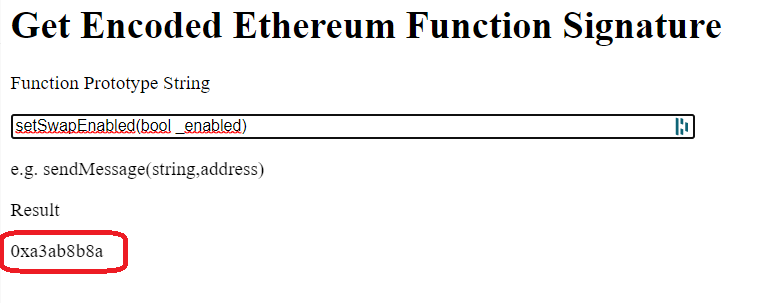

# 🔍 Mempool Scan


The transactions for adding or removing liquidity (add Liquidity etc ...) are sent to the Router address.&#x20;

While enable trading transactions (TradingEnabled, EnableTrading etc ...) are sent to the token address.


The bot can scan either on the router address or on the token address.

Depending on the transaction you are looking for, you will need to select Trading enabled or addingliquidity. After that you will have to enter the methoids in the corresponding field.

## How to find MethoId for Enable Trading

First of all search for the token in the reference scanner (bscsca, etherscan etc ...)

<figure><figcaption>
Search a token by token address
</figcaption></figure>

Than click on Contract -> Write Contract

<figure><figcaption>
Click on Contract, than on Write Contract
</figcaption></figure>

Now look for the name of the method which appears to be to enable trading (or whatever other method you want to intercept)

<figure><figcaption>
Search for the method
</figcaption></figure>

Now go back and click on CODE

<figure><figcaption>
Click on code
</figcaption></figure>

From the Contract source code window, click anywhere within the code. Press CTRL + F (to search) and enter the name of the method you found earlier. In our case, setSwapEnabled

<figure><figcaption>
Search the method in the source code
</figcaption></figure>

Now you have to copy the name of the function in full, taking care not to copy empty spaces before or after the name itself, but in any case also copying the parameters that are in the brackets

<figure><figcaption>
Copy the function name with its arguments brackets included
</figcaption></figure>

Now go to this site and paste the function name with the respective parameters and brackets



<figure><figcaption>
This is your methoId
</figcaption></figure>

The result will be the methoid you need to use in the bot!
